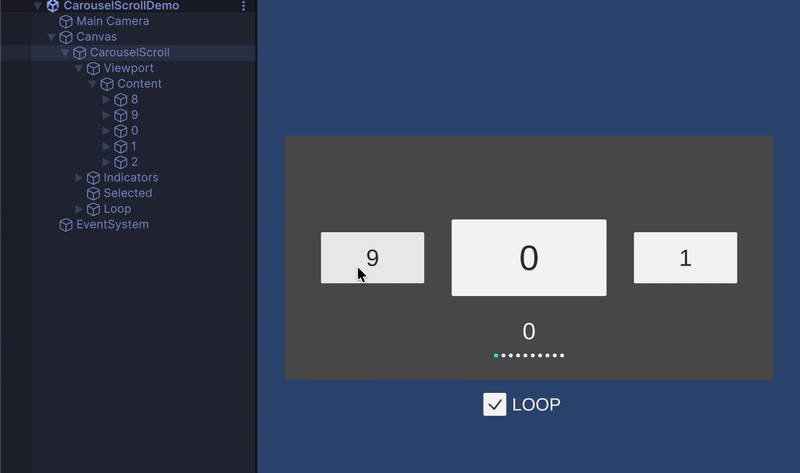

## 🎯 Concept

**SimpleScroll** is a lightweight and simple uGUI scroll view component collection for Unity.

### Guiding Principles
- **Pick the right class for your purpose**  
  We provide scroll classes for various use cases: fixed size, variable size, auto layout, grid, and carousel.

- **High Performance**  
  Unused cells are not generated but reused (virtualization), ensuring smooth performance even with large numbers of items.

- **Easy to Understand**  
  The structure clearly shows **what it can do** and **which class to use**.

### Intended Use Cases
- Menu lists, item lists, product galleries
- Carousel sliders, card UI
- Uniform-size lists that require fast scrolling

---

## 🧩 Scroll Types

### 🎯 **FixedListScroll**
- Single-column, supports multiple cell types
- Fixed cell size (fastest performance)
- Ideal for uniform-size item lists or menus

---

### ⚙️ **SizedListScroll**
- Single-column, supports custom cell sizes
- Most versatile list scroll
- Suitable for feeds or lists with variable item heights

---

### 🪄 **AutoLayoutListScroll**
- Single-column, supports multiple cell types
- Automatically uses RectTransform sizes
- Easy to set up, but **has some overhead**
- **Scrollbar may not display accurately** in some cases

---

### 🧱 **FixedGridScroll**
- Multi-column, supports multiple cell types
- Fixed cell size (Vector2)
- Ideal for item grids, store UI, or gallery layouts

---

### 🎠 **CarouselScroll**
- Single-column, supports multiple cell types
- Fixed cell size
- Supports looped scrolling
- Perfect for carousel UI with snap-to-center functionality

