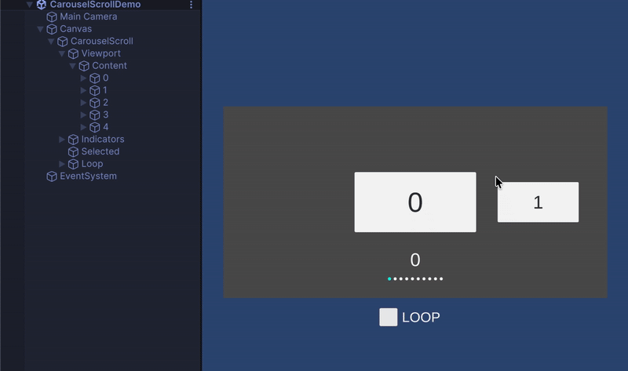

## 🎯 Concept

**SimpleScroll** is a lightweight and simple uGUI scroll view component collection for Unity.

### Guiding Principles
- **Pick the right class for your purpose**  
  We provide scroll classes for various use cases: fixed size, variable size, auto layout, grid, and carousel.

- **High Performance**  
  Unused cells are not generated but reused (virtualization), ensuring smooth performance even with large numbers of items.

- **Easy to Understand**  
  The structure clearly shows **what it can do** and **which class to use**.

### Intended Use Cases
- Menu lists, item lists, product galleries
- Carousel sliders, card UI
- Uniform-size lists that require fast scrolling

### Installation
Git Path (Unity Package Manager)
> https://github.com/kurobon-jp/SimpleScroll.git?path=Assets/

---

## 🧩 Scroll Types

### 🎯 **FixedListScroll**
- Single-column, supports multiple cell types
- Fixed cell size (fastest performance)
- Ideal for uniform-size item lists or menus


---

### ⚙️ **SizedListScroll**
- Single-column, supports custom cell sizes
- Most versatile list scroll
- Suitable for feeds or lists with variable item heights


---

### 🪄 **AutoLayoutListScroll**
- Single-column, supports multiple cell types
- Automatically uses RectTransform sizes
- Easy to set up, but **has some overhead**
- **Scrollbar may not display accurately** in some cases


---

### 🧱 **FixedGridScroll**
- Multi-column, supports multiple cell types
- Fixed cell size (Vector2)
- Ideal for item grids, store UI, or gallery layouts


---

### 🎠 **CarouselScroll**
- Single-column, supports multiple cell types
- Fixed cell size
- Supports looped scrolling
- Perfect for carousel UI with snap-to-center functionality




## 🚀 Quick Start (Unity Example)

``` C#
    /// <summary>
    /// Minimal example implementation
    /// </summary>
    public class ListScrollDemo : MonoBehaviour, IDataSource
    {
        [SerializeField] private FixedListScroll _listScroll;
        [SerializeField] private CellView _cellView;
        [SerializeField] private int _dataCount = 10;

        void Start()
        {
            // Assign this class as the data source for the scroll view.
            // The scroll will call IDataSource methods (GetDataCount, SetData, etc.)
            // to populate its cells.
            _listScroll.SetDataSource(this);

            // Refresh the scroll content to display the data immediately.
            // Must be called after setting the data source.
            _listScroll.Refresh();
        }

        /// <summary>
        /// Returns the total number of data items to be displayed in the scroll view.
        /// </summary>
        /// <returns>The number of data elements.</returns>
        int IDataSource.GetDataCount()
        {
            return _dataCount;
        }

        /// <summary>
        /// Assigns data to a given cell GameObject based on its index.
        /// </summary>
        /// <param name="index">The index of the data item.</param>
        /// <param name="go">The GameObject representing the cell view.</param>
        void IDataSource.SetData(int index, GameObject go)
        {
            if (go.TryGetComponent<CellView>(out var cellView))
            {
                cellView.Setup(index);
            }
        }

        /// <summary>
        /// Returns the view type identifier for the cell at the given index.
        /// Useful when multiple cell prefabs are used.
        /// </summary>
        /// <param name="index">The index of the data item.</param>
        /// <returns>Type ID of the cell view.</returns>
        public int GetCellViewType(int index)
        {
            return 0;
        }

        /// <summary>
        /// Returns the prefab or GameObject that should be used as the cell view
        /// for the given data index.
        /// </summary>
        /// <param name="index">The index of the data item.</param>
        /// <returns>The cell view GameObject to display.</returns>
        GameObject IDataSource.GetCellView(int index)
        {
            // Return the prefab (GameObject) to be used for the specified cell index.
            // This method defines which cell view prefab should be instantiated.

            // If you have multiple cell types, choose the appropriate prefab here:
            /*
            switch (GetCellViewType(index))
            {
                case 1:
                    return _cellView1.gameObject;
                case 2:
                    return _cellView2.gameObject;
                case 3:
                    return _cellView3.gameObject;
            }
            */

            // For a single cell type, simply return the shared prefab.
            return _cellView.gameObject;
        }
    }
```
